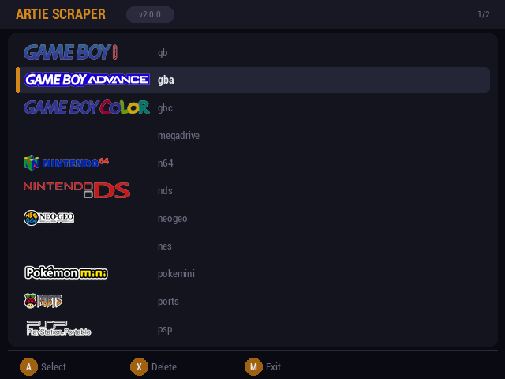
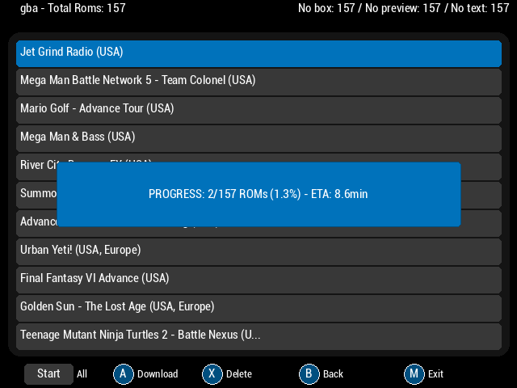

# Artie

Artie is a simple art scraper designed for Anbernic devices running MuOS. It helps you download and manage artwork for your ROMs, enhancing your gaming experience with beautiful visuals.

  
  

## Features

- Easy-to-use and minimal UI inspired from [tiny-scraper](https://github.com/Julioevm/tiny-scraper).
- Scrape per system or rom.
- Integrates seamlessly with MuOS.
- Highly customizable through `config.json`.
- Support for Box Art, Preview and Text (Synopsis).
- Option to delete all media for a selected system.
- It can work in other OSs as well with little adaptation.
- Supported media includes `["box-2D", "box-3D", "mixrbv1", "mixrbv2", "ss", "marquee"]`

## Installation / Usage

Follow these steps to install Artie:

1. **Download the Latest Release**:

   - Visit the [releases page](https://github.com/milouk/artie/releases) and download the latest version of Artie.

2. **Unzip the Downloaded File**:

   - Extract the contents of the downloaded zip file.

3. **Configure Artie**:

   In `Artie/.artie/config.json` ensure:

   a) `roms` is correctly configured to the path your roms are located.

   b) Add your [Screenscraper](https://screenscraper.fr/) credentials.

   c) For the systems you are interested to scrape ensure the paths are correct.

4. **Copy Files to MuOS**:

   - Copy the `Artie` directory to `/mnt/mmc/MUOS/application/`.

   This could be done via CLI with:

   `scp -r Artie/ root@<your IP>:/mnt/mmc/MUOS/application/`

5. **Launch Artie Scraper**:

   - Open MuOS and launch Artie Scraper from your applications menu.

## Contributing

We welcome contributions! Feel free to open issues or submit pull requests (PRs) to help improve Artie.

### How to Contribute

1. **Fork the Repository**:

   - Click the "Fork" button at the top right of the repository page.

2. **Clone Your Fork**:

   - Clone your forked repository to your local machine using `git clone`.

3. **Create a Branch**:

   - Create a new branch for your feature or bug fix.

4. **Make Changes**:

   - Implement your changes and commit them with clear and concise messages.

5. **Submit a Pull Request**:

   - Push your changes to your fork and submit a pull request to the main repository. Be sure to mention what feature you are implementing or which bug you are fixing.

### Reporting Bugs

If you encounter any bugs, please open an issue on the [GitHub issues page](https://github.com/milouk/artie/issues) with detailed information about the problem.

## License

This project is licensed under the MIT License. See the [LICENSE](LICENSE) file for details.

---

Thank you for using Artie! We hope it enhances your gaming experience on your Anbernic device.
