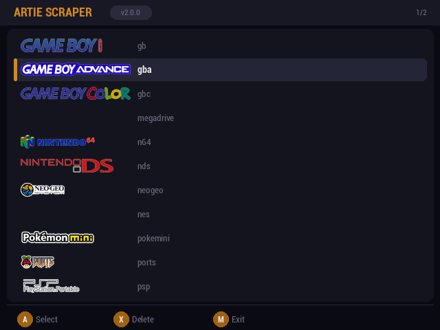
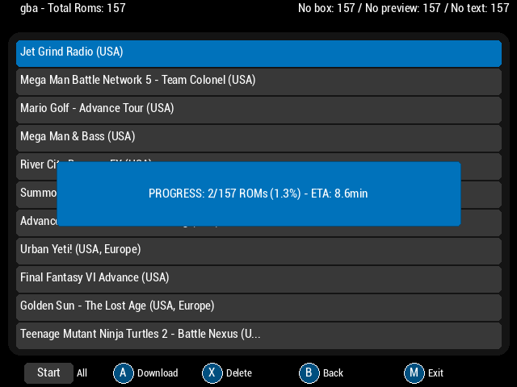

# Artie

Artie is a powerful art scraper designed for Anbernic devices running MuOS. It helps you download and manage artwork for your ROMs, enhancing your gaming experience with beautiful visuals and a highly optimized, responsive interface.

<div style="display: flex; justify-content: space-between;">
  
  
  
</div>

## Features

- **Modern dark UI** with amber accent theme, system logos, status badges, and progress bars
- **System logos** displayed inline in the emulator list (configurable via `show_logos`)
- **Scraping interruption** - press B to cancel batch scraping at any time
- **Visual progress bar** with ETA during batch scraping
- **Enhanced UI performance** with atomic transitions and double-buffered rendering
- **Advanced caching system** for improved performance and reduced API calls
- **Enhanced navigation** with page jumping capabilities (R1/R2, L1/L2)
- **Fully configurable color theme** via `config.json`
- Scrape per system or individual ROM
- Integrates seamlessly with MuOS
- Support for Box Art, Preview and Text (Synopsis)
- **Image mask processing** for custom box art and preview image enhancement
- Option to delete all media for a selected system
- Works on other OSs with minimal adaptation
- Supported media includes `["box-2D", "box-3D", "mixrbv1", "mixrbv2", "ss", "marquee"]`

## What's New in v2.0

### Modern UI

- Dark theme with amber/gold accent and configurable color palette
- System logos rendered inline in the emulator list
- Color-coded status badges (B/P/T) showing which media each ROM has
- Progress bar overlay with percentage and ETA during batch scraping
- Pill-shaped control buttons, page indicators, and visual separators

### Scraping

- **Cancel batch scraping** by pressing B at any time
- Non-blocking input polling so the UI stays responsive during scraping
- Thread-safe cancellation with `threading.Event`

### Performance & Stability

- Double-buffered rendering eliminates screen flash on transitions
- Logo cache prevents repeated disk reads
- Sentinel-based caching correctly stores `None` API results
- MD5 hashing uses 1MB chunks instead of 8KB
- Connection pooling for HTTP requests

### Navigation

- Page jumping with L1/R1 (by page) and L2/R2 (by 100)
- Separate position tracking for emulator and ROM lists

## Image Mask Processing

Artie includes powerful image mask processing capabilities that allow you to apply custom overlays and enhancements to your downloaded artwork. This feature is perfect for creating consistent visual themes or adding custom borders and effects to your box art and preview images.

### What Mask Processing Does

The mask functionality applies custom PNG overlay images to your downloaded artwork, allowing you to:

- Add consistent borders or frames to all artwork
- Apply visual effects like shadows, glows, or textures
- Create themed collections with matching visual styles
- Enhance artwork with custom overlays or watermarks

### Configuration Examples

To enable mask processing, configure the mask settings within each content type in your `config.json`:

```json
{
  "screenscraper": {
    "content": {
      "box": {
        "enabled": true,
        "type": "mixrbv2",
        "height": 240,
        "width": 320,
        "apply_mask": true,
        "mask_path": "assets/masks/box_mask.png",
        "resize_mask": true
      },
      "preview": {
        "enabled": true,
        "type": "ss",
        "height": 275,
        "width": 515,
        "apply_mask": true,
        "mask_path": "assets/masks/preview_mask.png",
        "resize_mask": true
      }
    }
  }
}
```

### Using Custom Mask Files

1. **Create your mask files**: Design PNG images with transparency that will serve as overlays
2. **Place mask files**: Put your mask files in the specified `mask_path` directory (default: `assets/masks/`)
3. **Configure mask settings**: Update your `config.json` to reference your mask files
4. **Enable mask processing**: Set `apply_mask` to `true` in your configuration

### Supported Mask Formats

- **PNG format**: Required for proper transparency support
- **Same dimensions**: Masks should match or exceed the dimensions of target artwork
- **Alpha channel**: Use transparency to control which parts of the mask are applied
- **Multiple masks**: Different masks can be applied to different media types (box art, previews, etc.)

### Performance Considerations

- Mask processing adds minimal overhead to the scraping process
- Masks are cached after first use for improved performance
- Large mask files may slightly increase processing time
- Disable mask processing if not needed to maximize scraping speed

## Navigation Controls

Artie supports intuitive navigation controls optimized for handheld gaming devices:

### Standard Navigation

- **D-pad**: Navigate through menus and options
- **A button**: Select/confirm actions
- **B button**: Go back/cancel (enhanced responsiveness)

### Advanced Navigation

- **L1/R1 buttons**: Jump by pages in ROM lists for quick navigation
- **L2/R2 buttons**: Large jumps through ROM collections
- **Page navigation**: Consistent across both systems and ROM views

### Quick Actions

- Navigate large ROM collections efficiently with page jumping
- Instant feedback on all button presses
- Consistent behavior across all interface screens

## Installation / Usage

Follow these steps to install Artie:

1. **Download the Latest Release**:

   - Visit the [releases page](https://github.com/milouk/artie/releases) and download the latest version of Artie.

2. **Unzip the Downloaded File**:

   - Extract the contents of the downloaded zip file.

3. **Configure Artie**:

   In `Artie/.artie/config.json` ensure:

   a) `roms` is correctly configured to the path your roms are located.

   b) Add your [Screenscraper](https://screenscraper.fr/) credentials.

   c) For the systems you are interested to scrape ensure the paths are correct.

   d) **Optional**: Configure mask processing settings if you want to apply custom overlays to artwork.

### Configuration Example

```json
{
  "roms": "/mnt/sdcard/ROMS",
  "logos": "assets/logos",
  "show_logos": true,
  "log_level": "info",
  "colors": {
    "primary": "#d4881c",
    "primary_dark": "#a06210",
    "secondary": "#1e1e2e",
    "secondary_light": "#2a2a3c",
    "secondary_dark": "#14141e"
  },
  "screenscraper": {
    "username": "your_username",
    "password": "your_password",
    "devid": "base64_encoded_dev_id",
    "devpassword": "base64_encoded_dev_password",
    "threads": 10,
    "show_scraped_roms": true,
    "content": {
      "synopsis": {
        "enabled": true,
        "lang": "en"
      },
      "box": {
        "enabled": true,
        "type": "mixrbv2",
        "height": 240,
        "width": 320,
        "apply_mask": false,
        "mask_path": "assets/masks/box_mask.png",
        "resize_mask": true
      },
      "preview": {
        "enabled": true,
        "type": "ss",
        "height": 275,
        "width": 515,
        "apply_mask": false,
        "mask_path": "assets/masks/preview_mask.png",
        "resize_mask": true
      },
      "regions": ["us", "eu", "jp", "wor"]
    },
    "systems": [
      {
        "dir": "SNES",
        "id": "4",
        "name": "Super Nintendo (SNES)",
        "box": "/mnt/mmc/MUOS/info/catalogue/Nintendo SNES-SFC/box/",
        "preview": "/mnt/mmc/MUOS/info/catalogue/Nintendo SNES-SFC/preview/",
        "synopsis": "/mnt/mmc/MUOS/info/catalogue/Nintendo SNES-SFC/text/"
      }
    ]
  }
}
```

   See [Configuration Options](#configuration-options) below for details on all settings.

4. **Copy Files to MuOS**:

   - Copy the `Artie` directory to `/mnt/mmc/MUOS/application/`.

   This could be done via CLI with:

   `scp -r Artie/ root@<your IP>:/mnt/mmc/MUOS/application/`

5. **Launch Artie Scraper**:

   - Open MuOS and launch Artie Scraper from your applications menu.

### Configuration Options

- **`roms`**: Path to your ROMs directory on the device
- **`logos`**: Path to system logo assets
- **`show_logos`**: Show system logos in the emulator list (`true`/`false`, default `true`)
- **`log_level`**: Logging verbosity (`"info"`, `"debug"`, etc.)
- **`colors`**: UI color theme customization
- **`screenscraper.username`** / **`password`**: Your Screenscraper account credentials
- **`screenscraper.devid`** / **`devpassword`**: Base64-encoded developer API credentials
- **`screenscraper.threads`**: Number of concurrent scraping threads
- **`screenscraper.show_scraped_roms`**: Whether to display already-scraped ROMs in the list
- **`content.box.type`**: Box art media type (e.g. `"mixrbv2"`, `"box-2D"`, `"box-3D"`)
- **`content.preview.type`**: Preview media type (e.g. `"ss"`, `"marquee"`)
- **`content.*.apply_mask`**: Enable mask overlay for that media type
- **`content.*.mask_path`**: Path to the mask PNG file
- **`content.*.resize_mask`**: Whether to resize the mask to match the image dimensions
- **`content.regions`**: Preferred region priority for artwork lookup
- **`systems`**: Array of system entries with ROM `dir`, Screenscraper `id`, and output paths for `box`, `preview`, and `synopsis`

## Troubleshooting

### Before Reporting Issues

**Always check the log file first**: Before reporting any errors or issues, please check the log file located at:

```
/mnt/mmc/MUOS/application/Artie/.artie/log.txt
```

This file contains detailed information about any errors, performance issues, or unexpected behavior that can help diagnose problems quickly.

### Common Issues and Solutions

#### Application Won't Start

- Check that all files are properly copied to `/mnt/mmc/MUOS/application/Artie/`
- Verify that `config.json` is properly formatted
- Check the log file for specific error messages

#### Slow Performance

- The caching system should improve performance after initial use
- Check available storage space on your device
- Review the log file for any caching issues

#### Navigation Issues

- Ensure your device's controls are properly calibrated
- Try restarting the application if navigation becomes unresponsive
- Check for any error messages in the log file

#### Scraping Problems

- Verify your Screenscraper credentials in `config.json`
- Check your internet connection
- Review API rate limiting messages in the log file
- Ensure ROM file paths are correctly configured

#### Media Not Displaying

- Check that media files were successfully downloaded
- Verify file permissions and storage space
- Review the log file for download errors

#### Mask Processing Issues

- **Masks not applying**: Verify that `apply_mask` is set to `true` for the relevant content type (`box` or `preview`) in `config.json`
- **Mask files not found**: Check that mask files exist at the specified `mask_path`
- **Poor mask quality**: Ensure mask files are PNG format with proper alpha channels
- **Performance issues**: Large mask files can slow processing - consider optimizing mask file sizes
- **Incorrect positioning**: Enable `resize_mask` or ensure mask dimensions match target artwork dimensions

#### Verifying Mask Files Are Working

1. Check the log file for mask processing messages
2. Verify processed images have the expected overlay effects
3. Ensure mask files are properly formatted PNG images with transparency
4. Test with a simple mask first before using complex designs

#### Mask Performance Considerations

- Disable mask processing (set `apply_mask` to `false` per content type) if not needed for faster scraping
- Use optimized PNG files to reduce processing time
- Consider mask file sizes - larger files require more processing power
- Monitor available storage space as processed images may be larger

### Getting Help

If you continue to experience issues after checking the log file and trying the solutions above:

1. Include relevant portions of your `log.txt` file when reporting issues
2. Provide your device model and MuOS version
3. Describe the steps that led to the problem
4. Open an issue on the [GitHub issues page](https://github.com/milouk/artie/issues)

## Technical Details

### Architecture

- **Atomic state transitions**: Ensures UI consistency and prevents race conditions
- **Advanced caching**: Intelligent ROM data and media caching with automatic cleanup
- **Modular design**: Clean separation between UI, data management, and API layers
- **Error recovery**: Comprehensive error handling with graceful degradation

### Performance Features

- **Optimized rendering**: Smooth transitions and responsive UI updates
- **Memory management**: Efficient resource usage and automatic cleanup
- **Caching strategy**: Smart caching of ROM metadata and artwork
- **Input optimization**: Low-latency input handling for responsive controls

### Logging and Debugging

- **Comprehensive logging**: Detailed logs for all operations and errors
- **Performance monitoring**: Tracking of load times and resource usage
- **Error tracking**: Detailed error information for troubleshooting
- **Debug information**: Helpful debugging data for development and support

## Contributing

We welcome contributions! Feel free to open issues or submit pull requests (PRs) to help improve Artie.

### How to Contribute

1. **Fork the Repository**:

   - Click the "Fork" button at the top right of the repository page.

2. **Clone Your Fork**:

   - Clone your forked repository to your local machine using `git clone`.

3. **Create a Branch**:

   - Create a new branch for your feature or bug fix.

4. **Make Changes**:

   - Implement your changes and commit them with clear and concise messages.

5. **Submit a Pull Request**:

   - Push your changes to your fork and submit a pull request to the main repository. Be sure to mention what feature you are implementing or which bug you are fixing.

### Reporting Bugs

If you encounter any bugs, please:

1. **Check the log file first** at `/mnt/mmc/MUOS/application/Artie/.artie/log.txt`
2. Open an issue on the [GitHub issues page](https://github.com/milouk/artie/issues) with:
   - Detailed information about the problem
   - Relevant log file excerpts
   - Steps to reproduce the issue
   - Your device and MuOS version information

## License

This project is licensed under the MIT License. See the [LICENSE](LICENSE) file for details.

---

Thank you for using Artie! This enhanced version provides a significantly improved experience with better performance, reliability, and user experience on your Anbernic device.
