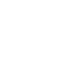
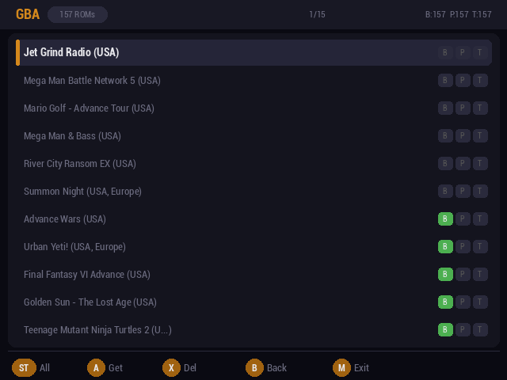
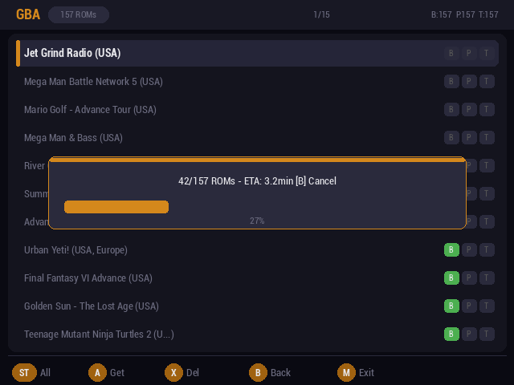

<p align="center">
  
</p>

<h1 align="center">Artie</h1>

<p align="center">
  <strong>Art scraper for Anbernic devices running muOS</strong>
</p>

<p align="center">
  <a href="https://github.com/milouk/artie/releases/latest"></a>
  <a href="https://github.com/milouk/artie/blob/main/LICENSE"></a>
  <a href="https://github.com/milouk/artie/releases/latest"></a>
  <a href="https://screenscraper.fr/"></a>
</p>

<p align="center">
  
  
  
</p>

---

Artie scrapes box art, previews, screenshots, videos, synopses, and metadata from [ScreenScraper](https://screenscraper.fr/) and organises them into the muOS catalogue so your game library looks the way it should. It runs directly on your Anbernic handheld — no PC required after installation.

## Features

### Scraping & Media

- Box art, previews, screenshots, and gameplay videos from [ScreenScraper](https://screenscraper.fr/)
- Metadata for every ROM: genre, developer, publisher, player count, release date
- Localized synopsis with configurable language
- Region priority presets (US, EU, JP, BR, World) so you always get the right cover
- Multiple media types: `mixrbv2`, `mixrbv1`, `box-2D`, `box-3D`, `ss`, `sstitle`, `fanart`
- Custom PNG mask overlays on box art and previews with auto-resize
- Scrape a single ROM, all ROMs in a system, or batch scrape across selected systems

### Search & Discovery

- Automatic fallback search when a ROM hash isn't found in the database
- Refine Search: when auto-matching fails, type a custom query via the on-screen keyboard and pick the correct game yourself
- Per-system batch selection: choose exactly which systems to include before a batch scrape

### Performance

- Multi-threaded scraping (1-20 threads, configurable)
- Automatic thread limit based on your ScreenScraper account tier
- API response caching so repeat scrapes skip already-fetched data
- Connection pooling for faster downloads
- Hold-to-scroll with key repeat on D-pad navigation

### Interface

- Dark and light themes, switchable from settings
- System logos displayed inline in the emulator list
- ROM detail view with box art, preview, synopsis, and metadata at a glance
- Progress bar with ETA and cancel support during batch scrapes
- Missing-media filter to hide already-scraped ROMs
- On-screen virtual keyboard for text entry (credentials, search queries)
- In-app settings screen: edit every option without touching config files
- Offline mode: browse your library without any network calls

### Device & Data

- OTA updates: check, download, and apply new versions without leaving the app
- Backup your entire catalogue (art, previews, text) to SD2
- Delete media per-ROM or per-system to reclaim storage
- 110+ gaming systems supported out of the box

## Installation

1. Download **`Artie.muxapp`** from the [latest release](https://github.com/milouk/artie/releases/latest)
2. Copy it to **`/mnt/mmc/MUOS/ARCHIVE/`** on your SD card
3. On your device, open **Applications > Archive Manager** and install Artie
4. Launch Artie from the muOS applications menu
5. On first launch you'll be prompted to enter your [ScreenScraper](https://screenscraper.fr/) credentials

> **Tip:** Create a free ScreenScraper account at [screenscraper.fr](https://screenscraper.fr/) if you don't have one. Higher-tier accounts get more threads and faster scraping.

## Controls

### Systems Screen

| Button | Action |
|--------|--------|
| D-pad | Navigate systems |
| A | Select system |
| X | Delete system media |
| START | Batch scrape (opens system selection) |
| SELECT | Backup catalogue to SD2 |
| Y | Settings |
| L1 / R1 | Page up / down |
| L2 / R2 | Jump 100 entries |
| MENU | Exit |

### ROMs Screen

| Button | Action |
|--------|--------|
| D-pad | Navigate ROMs |
| A | Scrape selected ROM |
| X | Delete ROM media |
| Y | ROM detail view |
| B | Back to systems |
| START | Scrape all ROMs in system |
| L1 / R1 | Page up / down |
| L2 / R2 | Jump 100 entries |
| MENU | Exit |

### ROM Detail Screen

| Button | Action |
|--------|--------|
| A | Scrape (shown only when media is missing) |
| B | Back |

### Virtual Keyboard

| Button | Action |
|--------|--------|
| D-pad | Move cursor |
| A | Type character |
| B | Delete last character |
| X | Cycle layout (lower / upper / symbols) |
| Y | Cancel |
| START | Confirm |

### System Selection Screen (batch scrape)

| Button | Action |
|--------|--------|
| D-pad | Navigate systems |
| A | Toggle system on/off |
| X | Toggle all |
| START | Begin scraping selected |
| B | Cancel |

## Settings

All settings are edited in-app via the settings screen (press **Y** on the systems screen). Changes are saved to `settings.json` in the application directory.

| Setting | Type | Default | Description |
|---------|------|---------|-------------|
| **Account** | | | |
| Username | text | | ScreenScraper username |
| Password | text | | ScreenScraper password |
| **Scraping** | | | |
| Threads | 1-20 | 10 | Concurrent download threads |
| Show All ROMs | toggle | on | Show already-scraped ROMs in lists |
| Region Priority | choice | us | Region ordering preset (us/eu/jp/br/wor) |
| **Media** | | | |
| Box Art | toggle | on | Scrape box art |
| Box Type | choice | mixrbv2 | `mixrbv2`, `mixrbv1`, `box-2D`, `box-3D` |
| Box Mask | toggle | off | Apply PNG mask overlay to box art |
| Box Mask Path | text | assets/masks/box_mask.png | Path to mask file |
| Preview | toggle | on | Scrape preview screenshots |
| Preview Type | choice | ss | `ss`, `sstitle`, `fanart` |
| Preview Mask | toggle | off | Apply PNG mask overlay to previews |
| Preview Mask Path | text | assets/masks/preview_mask.png | Path to mask file |
| Synopsis | toggle | on | Scrape synopsis text and metadata |
| Video | toggle | off | Download gameplay videos (.mp4) |
| **Display** | | | |
| Show Logos | toggle | on | Show system logos in emulator list |
| Theme | choice | dark | `dark` or `light` |
| **Advanced** | | | |
| Offline Mode | toggle | off | Skip all API calls; browse-only |
| Log Level | choice | info | `debug`, `info`, `warning`, `error` |

### Image Masks

Apply custom PNG overlays (with alpha channel) to box art and/or previews. Enable the mask toggle, point the mask path to your PNG file, and Artie will composite it on every downloaded image.

### Offline Mode

When enabled, Artie skips credential validation, update checks, and all scraping API calls. You can still browse your ROM library and view previously scraped media. Useful when you're away from Wi-Fi or just want to browse.

## Supported Systems

110+ systems including: NES, SNES, Genesis, Game Boy, GBA, N64, PlayStation, Dreamcast, Saturn, Arcade (MAME, CPS1/2/3, Neo Geo), Atari (2600, 5200, 7800, Lynx, Jaguar, ST), Amiga, Commodore 64, MSX, Master System, Game Gear, TurboGrafx-16, PC Engine, WonderSwan, Virtual Boy, Neo Geo Pocket, Game & Watch, PICO-8, TIC-80, DOS, and many more.

The full system list is built in automatically — any system directory on your SD card that matches a known mapping will appear in the interface.

## File Paths

| Path | Description |
|------|-------------|
| `/mnt/mmc/MUOS/application/Artie/.artie/` | Application directory |
| `/mnt/mmc/MUOS/application/Artie/.artie/settings.json` | User settings |
| `/mnt/mmc/MUOS/application/Artie/.artie/log.txt` | Log file |
| `/mnt/sdcard/ROMS/` | Default ROM directory |
| `/mnt/mmc/MUOS/info/catalogue/` | muOS catalogue (where media is saved) |

## Troubleshooting

Check the log file first:

```
/mnt/mmc/MUOS/application/Artie/.artie/log.txt
```

Set **Log Level** to `debug` in settings for more detail.

| Problem | Solution |
|---------|----------|
| Blank screen on launch | Check that the `.muxapp` was installed via Archive Manager, not just copied |
| Credential prompt loop | Verify your ScreenScraper username and password; create a free account if needed |
| Scraping returns no results | ROM filenames may not match ScreenScraper hashes; use Refine Search (press A when prompted) |
| Decompression error | Known ScreenScraper issue with gzip responses; Artie retries automatically |
| Slow scraping | Increase thread count in settings (limited by your ScreenScraper account tier) |
| Media not showing in muOS | Ensure the system catalogue name matches; check the log for path mismatches |
| Out of storage | Delete media per-system with X on the systems screen, or disable media types you don't need |

## Building from Source

Requirements: Docker, Python 3.11+

```bash
# Set ScreenScraper dev credentials
export SS_DEV_ID="your_base64_dev_id"
export SS_DEV_PASSWORD="your_base64_dev_password"

# Build ARM64 binary and create .muxapp
./deploy.sh build
```

The build uses `batonogov/pyinstaller-linux:v4.7.2` to cross-compile a single-file ARM64 binary with SDL2 dependencies bundled.

## Contributing

1. Fork the repo
2. Create a feature branch
3. Submit a pull request

Bug reports welcome on the [issues page](https://github.com/milouk/artie/issues) — include log excerpts and device info.

## License

[GPLv3](LICENSE)
